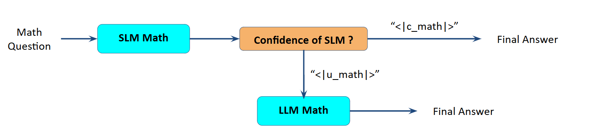

# Confidence-Aware Task Delegation via Supervised Fine-Tuning with LoRA

## Overview

This repository implements a confidence-aware task delegation framework using supervised fine-tuning (SFT) with Low-Rank Adaptation (LoRA). The methodology introduces specialized confidence tokens—`<|c_math|>` (confident) and `<|u_math|>` (uncertain)—to enable small language models (SLMs) to self-assess their prediction confidence and delegate uncertain tasks to larger language models (LLMs).

## Methodology

### Step 1: Training Dataset Generation

We constructed a confidence-annotated training dataset based on the MATH-500 benchmark (6,750 training samples). The dataset generation process follows these steps:

1. **Response Generation**: The Qwen 2.5 Math-Instruct 1.5B model generates responses with reasoning for each problem in the MATH-500 training set.
2. **Confidence Annotation**: Each generated response is evaluated against the ground truth answer:
   - Correct predictions are annotated with `<|c_math|>` (confident token)
   - Incorrect predictions are annotated with `<|u_math|>` (uncertain token)
3. **Dataset Publication**: The annotated dataset is published as `Akirayasha/math-20` on Hugging Face.

The `read_data.py` module provides utilities to download and preprocess the dataset, formatting examples as: `{system_prompt} {user_question} {assistant_response} {confidence_token}`.

### Step 2: LoRA Fine-Tuning

The base model is fine-tuned using LoRA to learn confidence-aware behavior. The training configuration is as follows:

**Hyperparameters:**
- Epochs: 5
- Learning rate: 5e-5

**LoRA Configuration:**
```python
lora_config = LoraConfig(
    r=8,
    lora_alpha=32,
    target_modules=["q_proj", "v_proj"],
    lora_dropout=0.05,
    bias="none",
    task_type="CAUSAL_LM"
)
```

Following fine-tuning, the model exhibits the learned behavior of appending confidence tokens to its responses. The trained LoRA adapter weights are saved to the `finetuned_models` directory.

### Step 3: Model Inference and Evaluation

The fine-tuned model is evaluated on the MATH-500 test set using vLLM for accelerated inference. Evaluation is performed via the `run_evaluation.py` script, with results stored in the `exp_20_11` directory.

**Evaluation Metrics:**
- **Response Accuracy**: 72%
- **Confidence Calibration Accuracy**: 76%
- **Confidence Token Distribution**:
  - `<|c_math|>`: 345 instances
  - `<|u_math|>`: 143 instances
  - No confidence token: 12 instances

**Confidence Calibration Accuracy** measures the alignment between predicted confidence and actual correctness. It is computed as the proportion of samples where the model correctly self-assesses its confidence (i.e., generates `<|c_math|>` for correct answers or `<|u_math|>` for incorrect answers).

### Step 4: Intelligent Task Delegation

We implement a hierarchical delegation framework where responses marked with `<|u_math|>` are escalated to a more capable LLM (Gemini 2.5 Flash) for re-processing. The delegation pipeline is illustrated below:



**Performance Comparison:**

| Metric | SLM 1.5B | SLM 7B | Delegation I | Delegation II | LLM |
|--------|----------|--------|--------------|---------------|-----|
| **Accuracy (%)** | 67.8 | 76.4 | 85.2 | 83.8 | 88.6 |
| **Cost (USD)** | $0.03 | $0.10 | $2.48 | $1.25 | $2.79 |

**Delegation Analysis:**

The following table provides a breakdown of task allocation and performance by model:

| Hand-Off Model | Correct Predictions | Total Questions | Accuracy | Cost (USD) |
|----------------|---------------------|-----------------|----------|------------|
| LLM (Gemini 2.5 Flash) | 121 | 155 | 78.06% | $1.23 |
| SLM (Qwen 1.5B) | 298 | 345 | 86.40% | $0.01 |

**Key Findings:**
- The delegation strategy (Delegation I) achieves 85.2% accuracy, representing a significant improvement over the standalone SLM (67.8%) while maintaining substantially lower cost than using the LLM exclusively (88.6% accuracy, $2.79).
- The SLM handles the majority of tasks (345 out of 500) with high accuracy (86.40%) and minimal cost, demonstrating effective confidence calibration.
- Delegated tasks to the LLM show an accuracy of 78.06%, indicating that uncertain cases remain challenging but benefit from the more capable model.